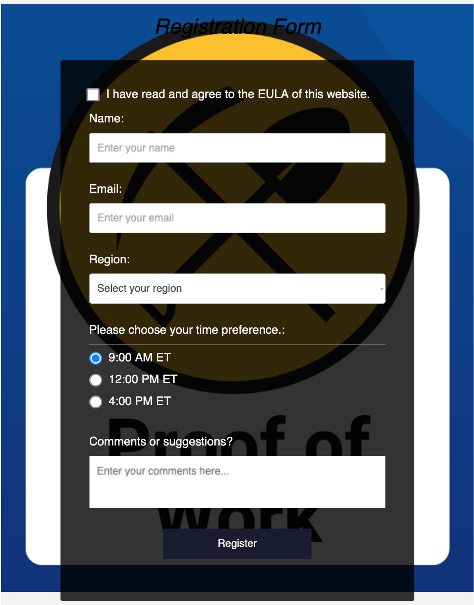

# contact form pow
This project serves a contact form that is protected with (hashcash) proof of work against spam. 

When you run the code it displays a basic contact form in your browser. To submit the form, your browser will need to solve a puzzle - essentially a math problem that requires time to solve. Once solved, the form submission will be accepted by the server and an email will be sent to you with the contents of the contact form.

This project was inspired by [hashcash-form-protect](https://github.com/jlopp/hashcash-form-protect). But it is designed to run everything server-side with javascript and Node.
 
## Environment Variables 
The environment variables to configure are in the sample.env file.  Copy the sample.env file to a .env file and make your changes.  You must set the 'YOUR_TO_EMAIL_ADDRESS', 'YOUR_FROM_EMAIL_ADDRESS' and 'SMTP' variables used to send emails.  The remaining variables can be left default.

1. YOUR_TO_EMAIL_ADDRESS / YOUR_FROM_EMAIL_ADDRESS - set to the addresses you want to send to / receive from the form submissions
2. SMTPHOST - smtp server
3. SMTPPORT - smtp server port number
4. SMTPSECURE - smtp server security (true or false)
5. SMTPUSER - username to login to smtp server
6. SMTPPASS - password to login to smtp server
7. HASHCASH_SALT - any random sequence of characters should suffice - just keep them secret
8. HASHCASH_DIFFICULTY - proof of work difficulty level (1 - 40); the higher the number the more difficult

## Logs
The program generates logs that are saved to the repo logs folder.

## Development
- `git clone` this repo
- `cd` into repo folder
- `npm i` to install dependancies
- `npm run dev` to start app with nodemon
- Go to http://localhost:5000/register in your browser

## Screenshot
